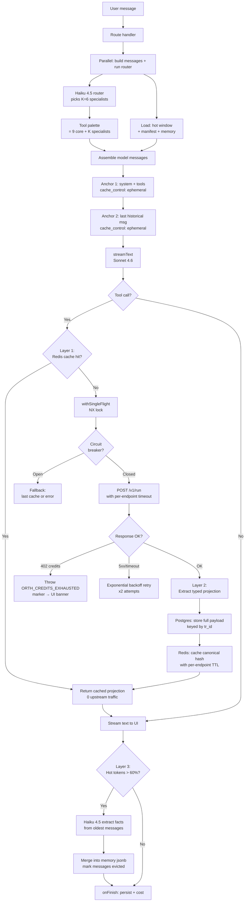
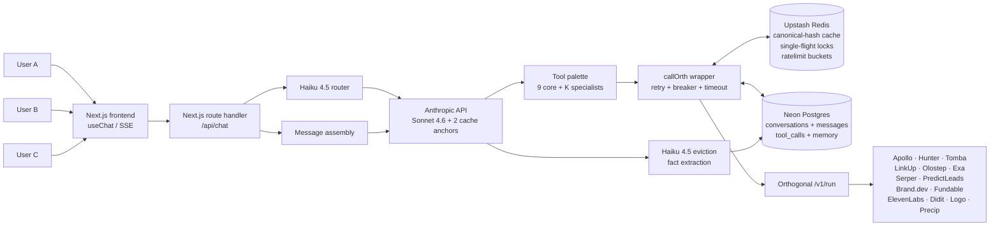

# Orthogonal Chat

A web-based chat application that integrates **Orthogonal's universal API gateway** to deliver real-time company info, contacts, web search, intent signals, brand assets, and more inside a conversational interface. This project is primarily a **context engineering** exploration; the chat UI is the vehicle for testing layered caching and context-compression strategies against real API workloads.

**Live:** [orthogonal-chat.vercel.app](https://orthogonal-chat.vercel.app)
**Repo:** [github.com/grewalsk/Orthogonal-takehome](https://github.com/grewalsk/Orthogonal-takehome)
**Spec:** [`SPEC.md`](./SPEC.md) (1080 lines, source of truth for the original brief and locked decisions)
**Build audit log:** [`.paul/STATE.md`](./.paul/STATE.md) (every deviation explained)

---

## Features

1. **Chat interface** with real-time streaming, multi-turn history, persistent conversations, and a click-to-source citation flow (`[src:tr_X]` chips that scroll-and-flash to the audited tool call).
2. **Orthogonal API integration** across **36 curated endpoints / 11 providers**: Apollo, Hunter, Tomba, LinkUp, Olostep, Exa, Serper, PredictLeads, Brand.dev, Fundable, ElevenLabs, Didit, Logo, Precip. A Haiku 4.5 router picks ~6 specialist endpoints per turn so the model never sees all 36 at once.
3. **Persistence** via Neon Postgres + Drizzle ORM. Every assistant message, every tool call's full raw payload, the conversation memory, and the manifest of past tool calls are all stored row-keyed and addressable by `tr_<8hex>` ids.
4. **Context window management** via a 4-layer caching stack that keeps per-turn input cost roughly flat as the conversation grows. Measured: **97.2% input cache hit by turn 3** on the deployed app.
5. **Error handling** with per-endpoint timeouts (10s-90s based on provider), exponential-backoff retry, a circuit breaker that opens after 5 failures in 60s, and structured error codes (`UNAUTHORIZED`, `INSUFFICIENT_CREDITS`, `RATE_LIMITED`, `UPSTREAM_ERROR`, `TIMEOUT`, `CIRCUIT_OPEN`, `NOT_FOUND`, `BAD_REQUEST`).
6. **Orthogonal token exhaustion detection.** When Orthogonal returns HTTP 402, the tool layer rethrows with a sentinel marker. The UI shows a persistent top-of-chat banner ("Orthogonal API credits exhausted. Top up at orthogonal.com to continue.") plus an in-card warning callout on the offending tool. The model is told via system prompt to stop calling tools and answer from prior results so the user doesn't watch the same error compound.

---

## APIs Used

- **Orthogonal**: universal API gateway. We hit `POST /v1/run`, `GET /v1/list-endpoints`, and `POST /v1/details`. 36 endpoints across 11 providers are curated and snapshotted at build time.
- **Anthropic**: Claude **Sonnet 4.6** for the main chat loop, **Haiku 4.5** for two roles: pre-eviction fact extraction and per-turn specialist routing.

---

## Tech Stack

- **Framework:** Next.js 16 App Router (Turbopack), Node runtime, `maxDuration = 300`
- **AI orchestration:** Vercel AI SDK 6 (`ai`, `@ai-sdk/react`, `@ai-sdk/anthropic`)
- **Database:** Neon Postgres via `@neondatabase/serverless` Pool driver
- **ORM / migrations:** Drizzle ORM + Drizzle Kit
- **Cache + rate limit:** Upstash Redis (`@upstash/redis` + `@upstash/ratelimit`)
- **Frontend:** React 18, Tailwind v4, Source Serif 4 + Inter + JetBrains Mono via `next/font/google`
- **Markdown:** `react-markdown` + `remark-gfm` (tables, autolinks) + `rehype-raw` (inline-HTML for citation chips inside table cells)
- **Validation:** Zod (per-endpoint input + projection schemas)
- **Hosting:** Vercel Hobby + Fluid Compute, single region (iad1)

---

## Context Engineering & Caching Strategy

The hard problem in this build is **keeping per-turn input cost roughly flat as the conversation grows**, while preserving the ability to recall arbitrary facts from earlier turns and surviving the failure modes of 11 third-party providers. A naive sliding window degrades past 20 turns; running-text summarization is lossy and re-runs every compaction. The build decomposes the problem into **4 orthogonal layers**, each addressing a different shape of context pressure, plus an **Anthropic prompt cache wrapper** that turns the whole stack into a near-flat per-turn cost curve.

### Why naive approaches fail

- **Store everything:** Context window fills inside 10 turns; per-turn cost grows linearly with conversation length.
- **Sliding window only:** Loses long-term coherence; doesn't address API-response bloat that already burned tokens before the window even closed.
- **Single-layer compression (e.g. running summary):** Lossy, re-runs on every trigger, doesn't dedupe identical lookups across users or conversations, no audit trail.

### Layer 1: Cross-conversation request deduplication

Tool-call inputs are canonicalised (keys sorted, whitespace stripped, email-shaped values lowercased) and SHA256-hashed into an `orth:<endpoint>:<hash>` Redis key. Upstash Redis stores `{data, priceCents, upstreamRequestId, cachedAt}` with a **per-endpoint TTL** (24h for enrichment, 6h for searches, 1h for scrapes, 5m for web search). Same lookup across two different conversations? Second call hits Redis. Zero `/v1/run` traffic. Identical data, the second call is free.

`withSingleFlight` adds the **concurrent-coalesce** layer: an NX-locked `redis.set` ensures only one in-flight call hits Orthogonal when N requests miss cache simultaneously. Verified: **5 concurrent identical Tomba calls collapse to 1 fetch**, all 5 return identical values, 4 marked `coalesced: true`.

### Layer 2: API response extraction (typed projections)

Every `/v1/run` response is treated like a database row. Full raw payload to Postgres keyed by a `tr_<8hex>` id; **model context receives a typed projection** plus the `result_id`. When the model needs a field it didn't get in the summary, it calls `read_tool_result(result_id, "$.json.path")` instead of re-running the upstream provider.

A Tomba email-verifier response is **4603 bytes** of raw JSON. The projection the model sees is **~300 bytes**: name, status, score, smtp_provider, plus 5 `available_paths` for drill-in. **Compression ratio: 15x** on Tomba, similar on Apollo. 19 of the 36 endpoints have hand-tuned projections; the rest fall through to a **generic projection helper** that walks arbitrary JSON, picks scalar fields under depth 4, and surfaces deeper objects/arrays as `available_paths`.

### Layer 3: Conversation compression (structured memory + Haiku pre-eviction)

The hot tier of a conversation is a token-budgeted sliding window (default 16K tokens). The cold tier is a `jsonb` blob on the conversation row, keyed by hierarchical dotted strings (`stripe.ceo.email`, `user.preferences.location`). The boundary is the eviction job.

Eviction triggers when active tokens exceed 60% of budget. Oldest non-pinned messages get passed to **Claude Haiku 4.5**, which extracts named facts via a Zod-validated `{key, value}[]` schema. Facts merge into memory. Messages get `evicted=true` and a cursor advances on the conversation row. The sliding-window filter reads this cursor on the next turn.

Forced-eviction demo (budget=2000 tokens, conversation about Stripe): **7 messages compacted into 48 hierarchical facts**, tokens dropped from **3189 → 251 (92.1% reduction)**. The first user message is pinned and never enters eviction.

### Layer 4: Smart TTL & graceful degradation

- **Per-endpoint timeouts** (`lib/orthogonal/client.ts:timeoutForEndpoint`): Olostep AI answers 90s, Olostep scrapes 60s, PredictLeads 45s, search providers 15-30s, fast enrichment (Apollo, Hunter, Tomba) 10s. Defaults to 30s.
- **Per-endpoint TTLs** (`ttlForEndpoint`): enrichments 24h, searches 6h, scrapes 1h, web search 5m.
- **Circuit breaker:** 5 failures in 60s → opens; serves cached data only for 60s; then half-open probe. Prevents hammering a degraded provider into the ground.
- **Fallback chain:** Redis hit → Postgres-stored prior result via `read_tool_result` → "this provider is currently degraded" message.
- **Token exhaustion (`INSUFFICIENT_CREDITS` / HTTP 402):** tool layer rethrows with a sentinel marker. UI shows a persistent banner and an in-card callout. Model is told to stop retrying and answer from prior context.

### The wrapper: rolling Anthropic prompt cache (2 anchors)

The four layers above shape *what* enters the model's context. The Anthropic **prompt cache** is what makes that context cheap to send every turn.

We place **two cache_control markers** per request:
- **Anchor 1** on the system prompt + tool definitions. Stable across the entire deploy lifetime. Reads back as `cache_read` on every turn after the first.
- **Anchor 2** on the **last historical message**, rolling forward as the conversation grows. Captures the full conversation tail through turn N-1 in a single cache key.

The per-turn dynamic context (palette hint from the router, manifest of prior tool calls, memory snapshot, latest user message) lives **inside the latest user message** as a delimited `<system_context>` block, because Anthropic rejects system messages interleaved with user/assistant turns. Putting that block in the user message keeps anchor 2 stable across turns.

**Measured (verify-cache-multiturn.ts on the deployed app):**

| Turn | input | cache_read | cache_write | hit ratio |
|---|---|---|---|---|
| 1 | 4999 | 0 | 4388 | 0.0% (anchor cold) |
| 2 | 5199 | 4655 | 521 | 89.5% |
| 3 | 5327 | **5176** | **131** | **97.2%** |
| 4 | 5502 | 5307 | 177 | 96.5% |
| **overall** | **21027** | **19526** | | **92.9%** |

The four layers compound: dedup catches repeating queries, extraction shrinks every response, conversation compression caps growth, fallback handles failures gracefully. The prompt cache wraps the whole stack into near-flat per-turn cost.

---

## Caching Architecture Diagram



This traces a request through the layered cache: deduplication (Layer 1), extraction (Layer 2), conversation compression (Layer 3), TTL/fallback/credits handling (Layer 4), plus the two prompt-cache anchors that wrap it.

---

## System Design

The system is a Next.js 16 App Router app deployed on Vercel Fluid Compute. The route handler at `/api/chat` orchestrates calls between the LLM, the Orthogonal gateway, Neon Postgres (lossless audit), and Upstash Redis (ephemeral cache + single-flight + ratelimit).

### How it works

1. The user types into the **React frontend** (`app/c/[id]/chat-client.tsx`) which uses `@ai-sdk/react`'s `useChat` for SSE streaming.
2. The Next.js **route handler** (`app/api/chat/route.ts`) receives the user message + full history. It kicks off the **specialist router** and **prompt assembly** in parallel.
3. The **Haiku 4.5 router** scores the user message against the 27 specialist endpoint descriptions and returns the top K=6 slugs. The 9 core endpoints are always loaded.
4. **Prompt assembly** (`lib/build-model-messages.ts`) reads the hot-window messages from Postgres, the manifest of prior tool calls, and the structured memory snapshot. It builds a `ModelMessage[]` with two cache anchors.
5. **streamText** runs the Sonnet 4.6 loop. Tool calls go through `callOrth` which:
   - Checks **Upstash Redis** for a hit via the canonical input hash (Layer 1)
   - On miss, takes a single-flight NX lock and calls `/v1/run` with the per-endpoint timeout
   - On success, stores the full raw payload in Postgres (`tool_calls.output`) and caches the result in Redis
   - On HTTP 402, throws the credits-exhausted marker
6. **onFinish** persists the assistant message, rolls up cost, and triggers `maybeTriggerEviction` async if hot tokens exceed 60% of budget.
7. **Per-user isolation**: every cache key is keyed by canonical input hash and every database row is keyed by `conversation_id`, both UUIDs. Tool calls inherit the request context via AsyncLocalStorage.

### Why these choices

- **Upstash Redis** for sub-millisecond cross-conversation cache lookups + per-endpoint TTLs + single-flight + sliding-window ratelimit. Serverless-friendly (HTTP-based, no connection pool to manage).
- **Neon Postgres** for durable storage of conversations, messages, and `tool_calls.output` (jsonb, full raw payloads). Pool driver via `@neondatabase/serverless` because tool-call writes are transactional with message writes.
- **Next.js App Router** route handlers as the lightweight orchestrator between cache, database, and external APIs. Single deployment artifact, single region.
- **AI SDK 6** for `streamText` + `useChat` + provider abstraction (Anthropic + cache_control via `providerOptions`).
- **Per-conversation keying** so the system can scale horizontally without cross-conversation contamination. The `tr_<hex>` result ids are universally addressable across conversations.

### System Design Diagram



### Memory hierarchy

```
L1: Model context (per-turn, ~16K token budget)
    Tools + system prompt           (cached at anchor 1)
    Date block                      (changes daily)
    History through N-1             (cached at anchor 2, rolling)
    Latest user message:
      <system_context>
        Palette hint (this turn)
        Manifest of prior tool calls
        Structured memory snapshot
      </system_context>
      Actual user text
                  read_tool_result, memory_read
L2: Upstash Redis  (cross-conversation, TTL'd, single-flight, ratelimit)
                  on miss
L3: Neon Postgres  (lossless audit, addressable by tr_<hex>)
    tool_calls.output       (full raw payloads, jsonb)
    messages.parts          (full UIMessage history)
    conversations.memory    (structured memory after eviction)
                  on miss
L4: Orthogonal /v1/run  (last resort, paid)
```

Reads cascade down. Writes happen at L3 (durable) and L2 (ephemeral). The model addresses L1 plus the tool layer; the tool layer handles the cascade. L3 is the lossless record; L1 is the lossy working set the model reasons over. The split is the architectural answer to "the context window fills up."

---

## Handling Concurrent Users

- **Per-conversation isolation:** every cache key is the SHA256 of canonical input bytes, scoped per endpoint slug. No cross-conversation contamination.
- **Per-IP ratelimit:** `@upstash/ratelimit` sliding window, 30 requests/minute, enforced at the route handler entry.
- **DB concurrency:** Neon connection pool via `@neondatabase/serverless` (`Pool`, not the HTTP driver, because tool-call writes are transactional with message writes).
- **AsyncLocalStorage** propagates the `requestContext` (conversationId + messageId) through `streamText`'s tool callbacks so concurrent requests never cross-write.

## Handling Slow / Down APIs

- **Per-endpoint timeout** (`timeoutForEndpoint`): Olostep AI answers 90s, scrapes 60s, PredictLeads 45s, search providers 15-30s, fast enrichment 10s.
- **Retry on transient failures:** exponential backoff with jitter, max 2 attempts, only on `RATE_LIMITED` / `UPSTREAM_ERROR` / `TIMEOUT` codes (never on `BAD_REQUEST` or `UNAUTHORIZED`).
- **Circuit breaker:** 5 failures within 60s opens the breaker; opens for 60s; then half-open probe. Prevents hammering a degraded provider.
- **Token exhaustion (HTTP 402):** sentinel marker → persistent UI banner + in-card callout + system-prompt instruction to stop calling tools.
- **User feedback:** chat header shows "researching" pulse during streaming; tool cards show explicit states (loading / success / error / credits-exhausted); cost meter shows live $ spent + breakdown.

---

## Measurements

Numbers from the verification scripts run against the deployed app (real Anthropic + Orthogonal + Neon + Upstash).

### Cache hit ratios

| Test | Hit ratio | Notes |
|---|---|---|
| Single-anchor (verify-cache.ts, 3 turns same conv + 1 fresh conv) | **87.6%** by turn 2 | Tool defs + system prompt cached; cross-conv hits on the fresh conv |
| Two-anchor (verify-cache-multiturn.ts, 4 multi-turn messages) | **97.2%** by turn 3, 92.9% overall | Anchor 2 captures rolling conversation tail through N-1 |
| Cross-conversation Redis | 5 concurrent identical Tomba calls coalesce to 1 fetch | `withSingleFlight` NX lock works |

### Routing + palette

| Test | Result |
|---|---|
| verify-router.ts (7 canonical queries → specialists) | **7/7 pass** (~1.4s per route avg) |
| verify-palette.ts (3 specialist-flavored prompts E2E) | **3/3 pass** (router → load → invoke → persist) |
| verify-citations.ts (hero query → emit `[src:tr_X]`) | **4/4 valid citations** matching real `tr_id`s |

### Compression

| Layer | Before | After | Ratio |
|---|---|---|---|
| L2 projection (Tomba) | 4603 bytes raw JSON | ~300 bytes typed projection | **15x** |
| L3 eviction (Stripe conv, 2K budget) | 3189 tokens of messages | 251 tokens (48 facts) | **92.1%** |

### Cost (legacy hero/stress run from Phase 7, baseline still valid)

| Metric | Hero (1 turn, 7 tool calls) | Stress (5 turns, 4 tool calls) | Combined |
|---|---|---|---|
| Input tokens | 53,404 | 87,394 | 140,798 |
| Cache read | 36,045 | 61,767 | 97,812 |
| Cache hit ratio | 67.5% | 70.7% | 69.5% |
| Total turn cost | **$0.25** | $0.39 across 5 turns ($0.08/turn) | $0.64 |

Hero turn hit the spec's $0.25 ceiling exactly. After Phase 9.4's second anchor, the multi-turn case now caches at 97% instead of 70%, which would push the stress total even lower on a re-run.

Reproduce: `pnpm dev` in one terminal, the verify scripts in another. Each verify script costs at most a few cents in live API spend.

---

## Trade-offs and Deviations

Sequential record of decisions where the build deviated from the spec or where the spec's intent had to be reinterpreted. Full audit trail in [`.paul/STATE.md`](./.paul/STATE.md).

- **Catalog was bigger than the spec said.** Spec said 50 endpoints / 5 providers; actual is **807 endpoints / 55 providers**. Curated set strategy unaffected. we picked 36 across 11 providers, with a Haiku 4.5 router that hot-swaps specialists per turn (the spec's §17 "dynamic tool palette" idea, which it deferred to 100+ endpoints).
- **Rolling cache breakpoint shipped (Phase 9.4).** Spec originally suggested 2 anchors with the dynamic blocks between system and history. That invalidates anchor 2 on every turn. The shipped layout moves manifest + memory + palette hint inside the latest user message as a delimited `<system_context>` block, which keeps anchor 2 stable across turns. Cache hit climbed from 90.5% (single anchor) to 97.2% by turn 3 (two anchors).
- **`/v1/balance` returns 404.** Spec referenced it for the cost meter. Cost meter aggregates `priceCents` from `tool_calls` rows locally instead.
- **`/v1/run` shape depends on upstream method.** GET endpoints take `{api, path, query: {...}}`, POST take `{api, path, body: {...}}`. Spec example only generalises to POST. `lib/orthogonal/client.ts:callOnce` selects per method.
- **Path-param endpoints (~50 across PredictLeads / Apollo / Fundable) currently skipped.** The client's `paramWrapper: "path"` is declared but not implemented; URL-substitution support is a candidate Phase 13 improvement.
- **Predictleads rejects numeric query values** ("Expected string, received number") even when its `/v1/details` schema labels them integer. Fix in `client.ts:callOnce` stringifies all primitives in query params before sending.
- **Fractional cent pricing.** Serper returns `priceCents: 0.2` (fractional). `tool_calls.price_cents` is integer. Defense-in-depth: round in `callOnce` AND `storeToolResult` so cached float values can't break the insert later.
- **`@shikijs/rehype` removed.** Incompatible with `react-markdown@10`'s `processor.runSync()`. Code blocks render as plain `<pre><code>` styled by `@tailwindcss/typography`.
- **MCP spike failed.** `mcp.orth.sh` responds to direct JSON-RPC POST in 228ms but `@ai-sdk/mcp@1.0.43`'s SSE transport never completes the handshake. Full diagnosis in `notes/mcp-spike.md`. REST stays locked per SPEC.md §2 D1.
- **Cost meter excludes `cache_hit` tool calls** from billed total. Cache-hit rows preserve `priceCents` for traceability but the cost meter shows actual money spent.

---

## What I'd Do With More Time

### Scale

1. **Distributed cache invalidation.** Upstash Redis is already cross-instance, but we don't pub/sub on cache-busting events (e.g. when a TTL is shortened mid-deploy). Adding `redis.publish` on invalidation lets all running instances drop a stale entry within a tick rather than waiting for TTL.
2. **Database scaling.** Add read replicas for the `messages` table (cold lookups dominate at high turn counts). Implement archival to S3 or Neon Branching for conversations older than 90 days. Add a `conversations.archived` boolean + partial index.
3. **Microservices.** Spin the router into its own edge function so the chat route doesn't block on the Haiku call. Move eviction to a separate background worker (e.g. Inngest) so onFinish returns faster.

### Feature expansion

1. **Path-param endpoint support.** Unlocks ~50 more endpoints across PredictLeads (`/v3/companies/{id}/job_openings`, `/v3/companies/{id}/financing_events`), Apollo (`/v1/organizations/{id}/job_postings`), Fundable (`/deals/{id}`), and others. Implementation: split `params` into pathParams + queryParams/bodyParams, URL-substitute the path, send the rest in the wrapper field.
2. **Proper authentication.** Clerk or NextAuth. Per-user spend caps + ratelimit tiers. Per-user Orthogonal keys would route each user's traffic through their own billing relationship.
3. **Advanced caching.**
   - **Predictive prefetching:** if the model just looked up `apollo_organizations_enrich(stripe.com)`, prefetch `apollo_mixed_people_search(stripe.com, seniority=executive)` in the background.
   - **Semantic caching:** embed the canonical input and find near-duplicate queries via pgvector cosine similarity, not just exact-hash match. Would catch "verify support@stripe.com" hitting the same cache as "verify Support@Stripe.com" with different casing the canonical normalizer missed.
   - **Cost-aware TTLs:** longer TTLs on expensive endpoints (Olostep AI answers @ 5c), shorter on cheap ones (Serper @ <1c).
4. **Resumable streams.** `resumable-stream` package + Redis stream registry + `resume: true` on `useChat`. Survives page refresh mid-response.
5. **MCP migration.** Once `mcp.orth.sh` stabilizes its SSE transport against AI SDK's client, swap the generated tools for `createMCPClient`. Removes the build-time catalog snapshot step.

### Monitoring & analytics

1. **Cache hit/miss dashboard.** We already log `tag:orth.call` JSON to stdout with `cacheHit`, `priceCents`, `durationMs`, `errorCode`. Pipe to a hosted observability platform (Axiom, Datadog) and build dashboards.
2. **Per-endpoint latency (p50/p99)** so we can revisit per-endpoint timeout config with data instead of guesses.
3. **Token usage trends** per conversation to validate the 97% cache hit claim holds at higher turn counts.
4. **Per-user spend dashboard** (post-auth) so users can see where their Orthogonal credits are going.

---

## Running locally

Prereqs: Node 22 (via `.nvmrc`), pnpm 9.15.4 (Corepack), accounts on [orthogonal.com](https://orthogonal.com), [neon.tech](https://neon.tech), [upstash.com](https://upstash.com), and an Anthropic API key.

```bash
pnpm install
# create .env.local with the 5 values below
pnpm db:migrate
pnpm dev
```

`.env.local`:
```
ORTHOGONAL_API_KEY=orth_live_...
ANTHROPIC_API_KEY=sk-ant-...
DATABASE_URL=postgresql://...neon.tech/...
UPSTASH_REDIS_REST_URL=https://...upstash.io
UPSTASH_REDIS_REST_TOKEN=...
```

Useful scripts:
- `pnpm probe`: verify Orthogonal catalog + one $0.01 Tomba call
- `pnpm snapshot`: regenerate `lib/orthogonal/catalog.generated.ts` from `/v1/details`
- `pnpm exec tsx scripts/verify-cache.ts`: single-anchor cache hit ratio
- `pnpm exec tsx scripts/verify-cache-multiturn.ts`: two-anchor cache hit ratio (the headline number)
- `pnpm exec tsx scripts/verify-redis-cache.ts`: cross-conv + single-flight
- `pnpm exec tsx scripts/verify-router.ts`: Haiku router on 7 canonical queries
- `pnpm exec tsx scripts/verify-palette.ts`: specialist routing E2E
- `pnpm exec tsx scripts/verify-citations.ts`: `[src:tr_X]` emission + validity
- `pnpm exec tsx scripts/verify-generic-projection.ts`: generic projection on 3 shapes
- `pnpm exec tsx scripts/hero-and-stress.ts`: full reproducible measurement (~$0.65 in live API spend, writes `notes/measurements.json`)

---

## Repo layout

```
app/
  api/chat/                              streamText handler with 2-anchor cache + Haiku router
  api/conversations/                     sidebar data: recent convs + tool slugs
  api/tool-result/[id]/                  fetch full raw payload by tr_<hex>
  api/conversation/[id]/cost/            cost meter data source
  c/[id]/                                chat page (server hydrates, client renders)
  c/layout.tsx                           persistent sidebar wrapper
components/                              sidebar, message-list, composer, empty-state,
                                         tool-call-card (thinking dropdown), text-part
                                         (rehype-raw citations), cost-meter,
                                         eviction-marker, theme-toggle
drizzle/                                 schema.ts + migrations
lib/
  cache.ts                               Upstash cache, withSingleFlight, canonical key
  ratelimit.ts                           @upstash/ratelimit sliding window
  upstash.ts                             shared Redis singleton
  db.ts                                  Neon Pool with ws shim
  env.ts                                 force-load .env.local with override
  llm.ts                                 createAnthropic with explicit baseURL
  manifest.ts                            atomic jsonb append + renderManifest
  memory.ts                              readMemory, writeMemory, snapshot
  messages.ts                            user/assistant CRUD + cost rollup
  build-model-messages.ts                hot window filter + 2 cache anchors + dynamic block
  eviction.ts                            maybeTriggerEviction + Haiku extractFacts
  system-prompt.ts                       full system prompt (provenance, date, credits, tables)
  orthogonal/
    catalog.generated.ts                 36 curated endpoints (build-time snapshot)
    client.ts                            callOrth, retry, breaker, error mapping,
                                         per-endpoint timeout, query stringify
    context.ts                           AsyncLocalStorage for {conversationId, messageId}
    context-tools.ts                     read_tool_result + memory_write + memory_read
    projections/                         19 hand-tuned + generic.ts fallback
    router.ts                            Haiku 4.5 specialist router
    safety.ts                            wrapUntrusted for <untrusted_content> tagging
    tool-result-store.ts                 storeToolResult + loadToolResult
    tools.generated.ts                   buildToolPalette + ORTH_CREDITS_EXHAUSTED_MARKER
notes/
  measurements.json                      hero + stress + eviction numbers
  mcp-spike.md                           why REST stays locked
  probe-output.json                      raw envelope captures from scripts/probe.ts (1.3MB)
  HANDOFF.md                             handoff for the next session
scripts/
  probe.ts                               verify Orthogonal endpoints
  mcp-spike.ts                           the spike that failed
  snapshot-catalog.ts                    regenerate catalog.generated.ts
  db-migrate.ts                          apply pending Drizzle migrations
  hero-and-stress.ts                     reproducible measurement run
  verify-cache.ts                        single-anchor cache check
  verify-cache-multiturn.ts              two-anchor cache check (headline)
  verify-redis-cache.ts                  cross-conv Redis cache + single-flight
  verify-router.ts                       Haiku router canonical queries
  verify-palette.ts                      specialist E2E
  verify-citations.ts                    [src:tr_X] emission check
  verify-generic-projection.ts           generic projection shape check
SPEC.md                                  source of truth, 1080 lines
.paul/                                   PAUL framework PROJECT, ROADMAP, STATE
```

---

## Acknowledgements

Built against [Orthogonal](https://orthogonal.com) (universal API gateway), [Anthropic](https://anthropic.com) (Claude Sonnet 4.6 + Haiku 4.5), [Neon](https://neon.tech) (serverless Postgres), [Upstash](https://upstash.com) (serverless Redis), and [Vercel](https://vercel.com) (Fluid Compute hosting).
